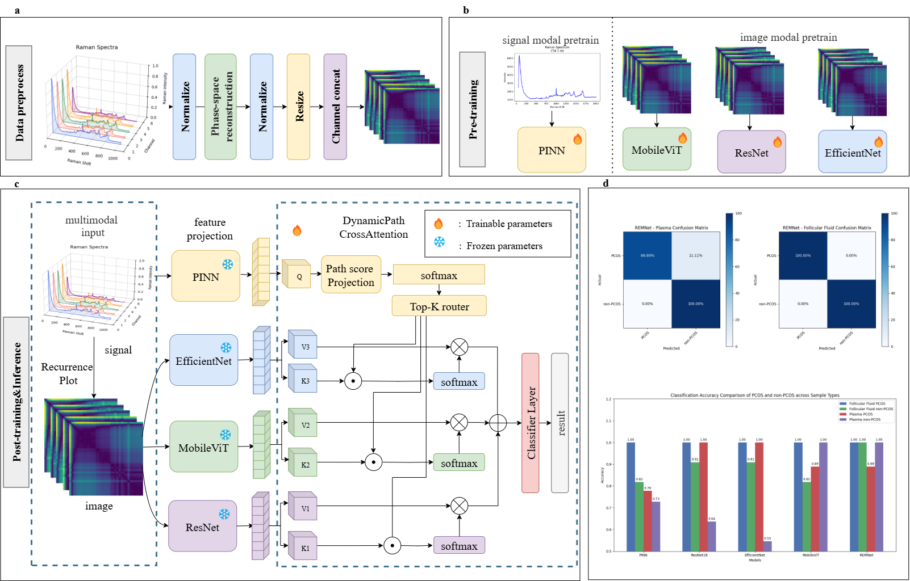

# <p align="center">🧬 PCOS Raman Spectrum Classification</p>

#### **基于多散点拉曼光谱（5×1024×2）的图像化与深度学习分类项目。**  
支持多种模型结构（RemNet(Ours)、ResNet、EfficientNet、MobileViT、PINN），并提供单样本预测与批量预测功能。

#### **A Deep Learning Classification Project Based on Multi-Point Raman Spectra (5×1024×2).**  
Supports multiple model architectures (RemNet (Ours), ResNet, EfficientNet, MobileViT, PINN), providing both single-sample and batch prediction modes.

<p align="center">   </p>

---

## ⚙️ 环境安装（Environment Setup）

项目依赖基于 **Python ≥ 3.8** 与 **PyTorch ≥ 1.10**。  
建议使用 `conda` 创建独立环境：

**Dependencies:** Python ≥ 3.8 and PyTorch ≥ 1.10.  
Recommended to use an independent conda environment.

```bash
conda create -n pcos python=3.9
conda activate pcos
```

安装依赖 / Install dependencies:

```bash
pip install -r requirements.txt
```

---

## 🚀 环境启动（Activate Environment）

```bash
conda activate pcos
```

---

## 🔮 预测（Prediction）

### ✅ 单个样本预测（Single-Sample Prediction）

```bash
python predict.py   --mode single   --input "/path/A1_1.txt,/path/A1_2.txt,/path/A1_3.txt,/path/A1_4.txt,/path/A1_5.txt"   --weight ./model.pth   --method rp
```

### ✅ 批量预测（Batch Prediction, CSV Output）

#### 🔹 MobileViT
**卵泡液 (Follicular Fluid)**  
**Follicular Fluid Dataset**

```bash
python predict.py   --image_root data/multi_images_Follicular\ Fluid   --method rp   --weight_path checkpoints/mobilevit_rp_foll_seed1.pth   --model_name mobilevit   --batch_size 16
```

**血浆 (Plasma)**  
**Plasma Dataset**

```bash
python predict.py   --image_root data/multi_images_Plasma   --method rp   --weight_path checkpoints/mobilevit_rp_plasma_seed1.pth   --model_name mobilevit   --batch_size 16
```

#### 🔹 EfficientNet
**Follicular Fluid**
```bash
python predict.py   --image_root data/multi_images_Follicular\ Fluid   --method rp   --weight_path checkpoints/efficientnet_rp_foll_seed9.pth   --model_name efficientnet   --batch_size 16
```

**Plasma**
```bash
python predict.py   --image_root data/multi_images_Plasma   --method rp   --weight_path checkpoints/efficientnet_rp_plasma_seed1.pth   --model_name efficientnet   --batch_size 16
```

#### 🔹 ResNet18
**Follicular Fluid**
```bash
python predict.py   --image_root data/multi_images_Follicular\ Fluid   --method rp   --weight_path checkpoints/resnet18_rp_follseed1.pth   --model_name resnet18   --batch_size 16
```

**Plasma**
```bash
python predict.py   --image_root data/multi_images_Plasma   --method rp   --weight_path checkpoints/resnet18_rp_plaseed9.pth   --model_name resnet18   --batch_size 16
```

---

## 🧠 模型训练（Model Training）

每个模型可通过命令行参数切换不同结构和数据集。  
Each model can be trained on different datasets via command-line parameters.


### K折交叉验证（k-fold cross validate）
```bash
python cross_validate.py \
    --image_root data/multi_images_Follicular_Fluid \
    --method rp \
    --model_name remnet \
    --epochs 100 \
    --batch_size 32 \
    --lr 1e-4 \
    --save_dir ./weights_cv
```

### 🔹 ResNet18
**Plasma**
```bash
python train_classifier.py   --model_name=resnet18   --image_root data/multi_images_plasma   --method rp --epochs 20 --batch_size 32 --lr 1e-4   --save_path checkpoints/resnet18_rp_plaseed9.pth --seed=9
```

**Follicular Fluid**
```bash
python train_classifier.py   --model_name=resnet18   --image_root data/multi_images_follicular   --method rp --epochs 20 --batch_size 32 --lr 1e-4   --save_path checkpoints/resnet18_rp_follseed9.pth --seed=9
```

### 🔹 EfficientNet
**Follicular Fluid**
```bash
python train_classifier.py   --model_name=efficientnet   --image_root data/multi_images_follicular   --method rp --epochs 205 --batch_size 32 --lr 1e-4   --save_path checkpoints/efficientnet_rp_foll_seed9.pth --seed=9
```

**Plasma**
```bash
python train_classifier.py   --model_name=efficientnet   --image_root data/multi_images_plasma   --method rp --epochs 200 --batch_size 32 --lr 1e-4   --save_path checkpoints/efficientnet_rp_foll_seed1.pth --seed=1
```

### 🔹 MobileViT
**Follicular Fluid**
```bash
python train_classifier.py   --model_name=mobilevit   --image_root data/multi_images_follicular   --method rp --epochs 200 --batch_size 32 --lr 1e-4   --save_path checkpoints/mobilevit_rp_foll_seed1.pth --seed=1
```

**Plasma**
```bash
python train_classifier.py   --model_name=mobilevit   --image_root data/multi_images_plasma   --method rp --epochs 200 --batch_size 32 --lr 1e-4   --save_path checkpoints/mobilevit_rp_plasma_seed1.pth --seed=1
```

### 🔹 PINN（Physics-Informed Neural Network）
**Follicular Fluid**
```bash
python train_classifier.py   --model_name=pinn   --image_root data/multi_images_follicular   --method rp --epochs 200 --batch_size 32 --lr 1e-4   --save_path checkpoints/pinn_rp_foll_seed1.pth   --seed=1 --use_pinn --lambda_phy=0.5
```

**Plasma**
```bash
python train_classifier.py   --model_name=pinn   --image_root data/multi_images_plasma   --method rp --epochs 500 --batch_size 32 --lr 1e-4   --save_path checkpoints/pinn_rp_pla_seed5.pth   --seed=5 --use_pinn --lambda_phy=0.5
```

### 🔸 Without PINN Loss (MSE Only)
**Plasma**
```bash
python train_classifier.py   --model_name=pinn   --image_root data/multi_images_Plasma   --method rp --epochs 500 --batch_size 32 --lr 1e-4   --save_path checkpoints/pinn_rp_pla_seed5_onlymse.pth --seed=5
```

**Follicular Fluid**
```bash
python train_classifier.py   --model_name=pinn   --image_root data/multi_images_Follicular_Fluid   --method rp --epochs 500 --batch_size 32 --lr 1e-4   --save_path checkpoints/pinn_rp_fol_seed5_onlymse.pth --seed=5
```

### 🔹 RemNet (Ours)
在加载PINN、ResNet18、EfficientNet和MobileViT的预训练权重后，训练RemNet。  
After loading pretrained weights of PINN, ResNet18, EfficientNet, and MobileViT, train RemNet.

**Follicular Fluid**
```bash
python train_classifier.py   --model_name=remnet   --image_root data/multi_images_follicular   --method rp --epochs 20 --batch_size 32 --lr 1e-4   --save_path checkpoints/rem_rp_foll_seed1.pth --seed=1
```

**Plasma**
```bash
python train_classifier.py   --model_name=remnet   --image_root data/multi_images_plasma   --method rp --epochs 20 --batch_size 32 --lr 1e-4   --save_path checkpoints/rem_rp_pla_seed1.pth --seed=1
```

---

## 📊 模型与数据说明（Models and Datasets）

| 模型名 / Model | 说明 / Description |
|:----------------|:------------------|
| **ResNet18** | 经典残差网络结构 / Classic residual CNN architecture |
| **EfficientNet** | 参数高效卷积网络 / Parameter-efficient CNN |
| **MobileViT** | 轻量Transformer混合网络 / Lightweight hybrid CNN-Transformer |
| **PINN** | 结合物理约束的神经网络 / Physics-Informed Neural Network |
| **Vison Transformer** | 基于Transformer的计算机视觉任务 / Transformer architecture to computer vision tasks. ‌|
| **Vison Mamba** | 基于Mamba的计算机视觉任务 / Mamba architecture to computer vision tasks. ‌|
| **RemNet (Ours)** | 基于动态路径注意力的多模态融合网络 / Multi-modal fusion network with dynamic pathway attention |

---

## 🧾 数据路径说明（Data Path Description）

| 数据集名称 / Dataset Name | 内容 / Content |
|:------------------|:------------------|
| **multi_images_Follicular_Fluid** | 卵泡液样本（5通道递归图） / Follicular Fluid samples (5-channel Recurrence Plots) |
| **multi_images_Plasma** | 血浆样本（5通道递归图） / Plasma samples (5-channel Recurrence Plots) |

---

<p align="center"><b>© 2025 PCOS Raman Classification Project — </b></p>


